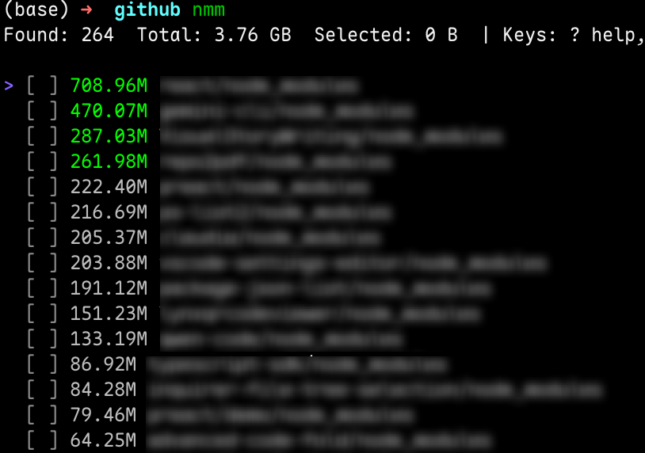

# node-module-man

Scan and clean `node_modules` across a folder recursively. Comes with a fast scanner, an interactive TUI for selecting directories to delete, and a scriptable CLI for CI or batch workflows.



## Features

- Fast, concurrent scan for `node_modules` (depth limiting, excludes, symlink options)
- TUI: live streaming results, sort, multi-select, confirm + delete, progress view
- CLI: JSON output, non-interactive deletion with `--yes`, batch delete from JSON
- Dry-run mode for safe validation, graceful cancellation during scanning/deleting

## Requirements

- Go 1.19+
- macOS/Linux/Windows (tested in CI-friendly setups)

## Build & Install

- One-off build (current OS/arch):
  - `go build ./cmd/node-module-man`
- Cross-platform build (macOS arm64+amd64 to `dist/`):
  - `./build.sh`
- Common tasks via Makefile:
  - `make build` • `make test` • `make fmt` • `make version VERSION=1.2.3`

Version injection: binaries can embed a version string via `-ldflags`.
- `VERSION=1.2.3 ./build.sh` or `make version VERSION=1.2.3`

## Quick Start (TUI)

- Scan current directory and open TUI:
  - `./node-module-man`

TUI key bindings (press `?` in the app for help):
- `↑/k`, `↓/j`: move cursor
- `space`: toggle selection
- `s`: toggle sort field (size/path)
- `r`: reverse sort
- `d` or `enter`: confirm deletion
- `?`: toggle help
- `q/esc`: quit; cancels ongoing scan or delete

## CLI Usage

- Disable TUI and print results (table or JSON):
  - Table: `./node-module-man --tui=false -p .`
  - JSON: `./node-module-man --tui=false --json -p .`

Key flags:
- `--path, -p`: root path to scan (default `.`)
- `--concurrency, -c`: workers for size calculations (default: CPU cores)
- `--max-depth, -m`: max directory depth to traverse (`-1` unlimited)
- `--exclude, -x`: repeatable glob/pattern to exclude (matches path or basename)
- `--follow-symlinks, -L`: follow symlinked directories
- `--dry-run, -d`: simulate deletion (no files removed)
- `--version`: print version and exit

### Delete (non-interactive)

Delete selected targets non-interactively with `--yes`. Input targets via JSON file or stdin:

- From file: `./node-module-man --tui=false --delete-json targets.json --yes`
- From stdin: `cat targets.json | ./node-module-man --tui=false --delete-stdin --yes`
- Add `--json` to get a machine-readable summary for CI.

Accepted JSON formats:
```json
["/abs/path/one", "/abs/path/two"]
```
```json
[{"path":"/abs/path/one","size":123}, {"path":"/abs/path/two"}]
```
```json
{"targets": ["/abs/path/one", {"path":"/abs/path/two","size":2048}]}
```

Deletion summary (when `--json`):
```json
{
  "Successes": [{"Path": "/abs/path/one", "Size": 123}],
  "Failures": [{"Path": "/abs/path/two", "Err": "permission denied"}],
  "Freed": 123
}
```

## Excludes & Filters

- `--exclude` patterns are matched against full path and basename.
- Simple wildcard forms like `*/examples/*` are supported.
- Examples:
  - Skip all `node_modules` inside `packages/a`: `--exclude '*/packages/a/*'`
  - Skip by basename (skip everything named `node_modules`): `--exclude node_modules`

## Performance & Symlinks

- Concurrency defaults to `runtime.NumCPU()`; tune via `--concurrency`.
- Limit traversal with `--max-depth` to avoid deep directory walks.
- Do not follow symlinked directories by default; enable with `-L/--follow-symlinks`.

## Safety Notes

- TUI requires confirmation before delete; press `y` on the confirm screen.
- CLI delete requires `--yes` to proceed without prompt.
- Use `--dry-run` during validation to simulate deletions safely.

## Development

- Project structure:
  - `cmd/node-module-man/` — entrypoint (CLI/TUI)
  - `internal/scanner/` — discovery + size computation
  - `internal/tui/` — Bubble Tea model and list UI
  - `internal/deleter/` — concurrent deletion with progress and dry‑run
  - `pkg/utils/` — helpers (byte formatting)
  - `scripts/` — utilities (e.g., fixtures)
  - `docs/` — PRD, plan, progress, known issues

## Tests

- Run: `go test ./...`
- Scanner tests cover discovery, depth, excludes, symlinks; deleter covers dry‑run and cancel.

## Fixtures (optional)

Generate test fixtures with a Node script (no network by default):
- `node scripts/make-test-fixtures.js --count 4`
- Add `--no-install` to skip `npm install` if the script supports it.

## Roadmap & Progress

- See `docs/features/todos.md` for planned items.
- See `docs/progress.md` for completed milestones.
- Known issues live under `docs/issues/`.

## Acknowledgements

- Built with the Charm stack: Bubble Tea and Lipgloss.

